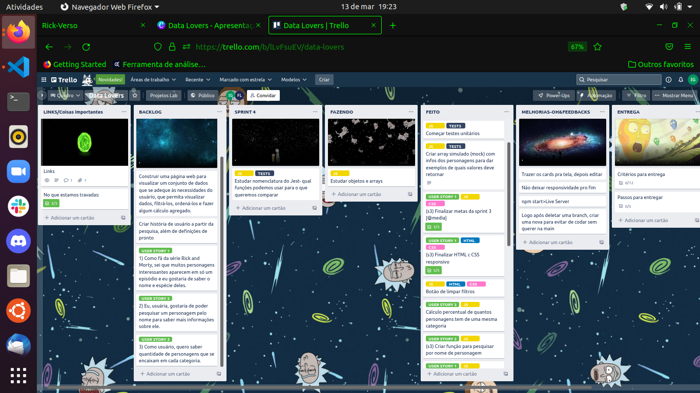
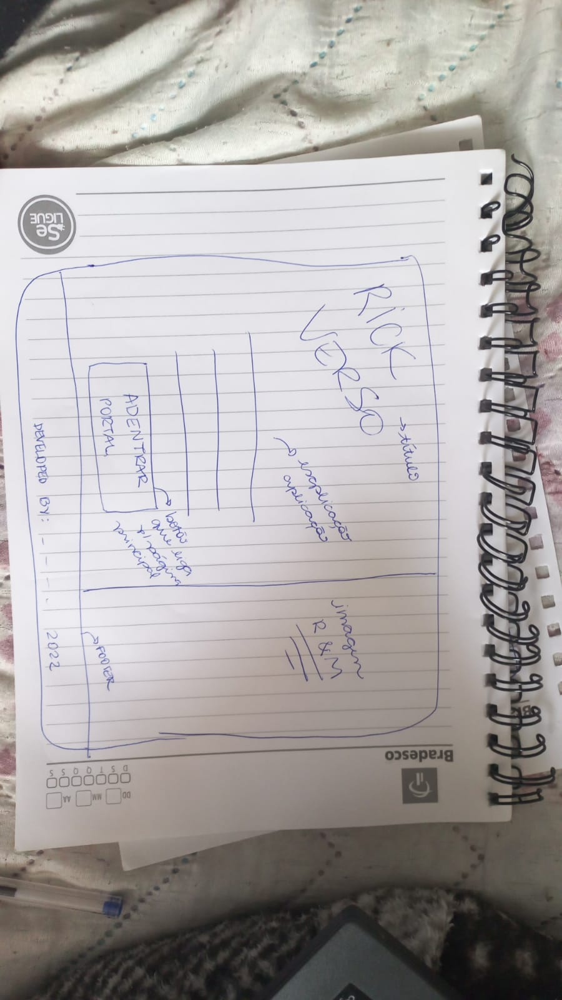
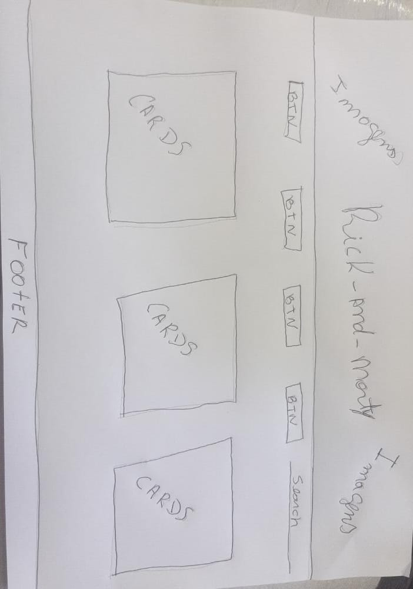
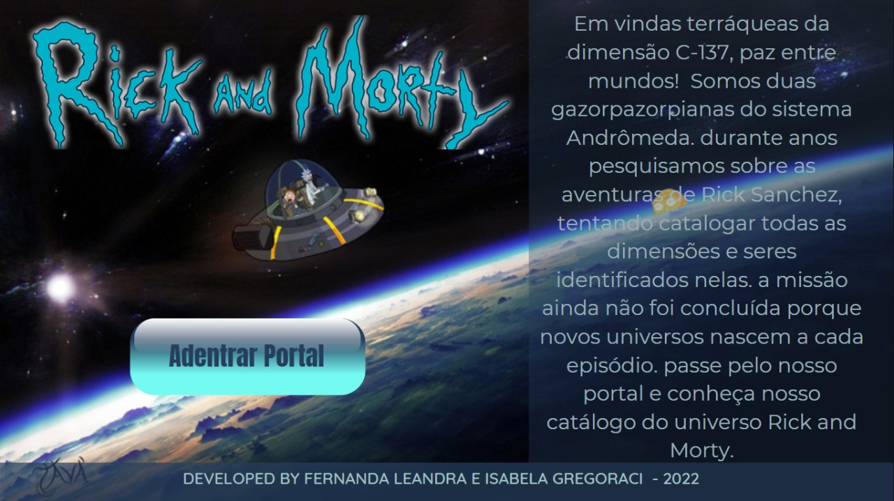
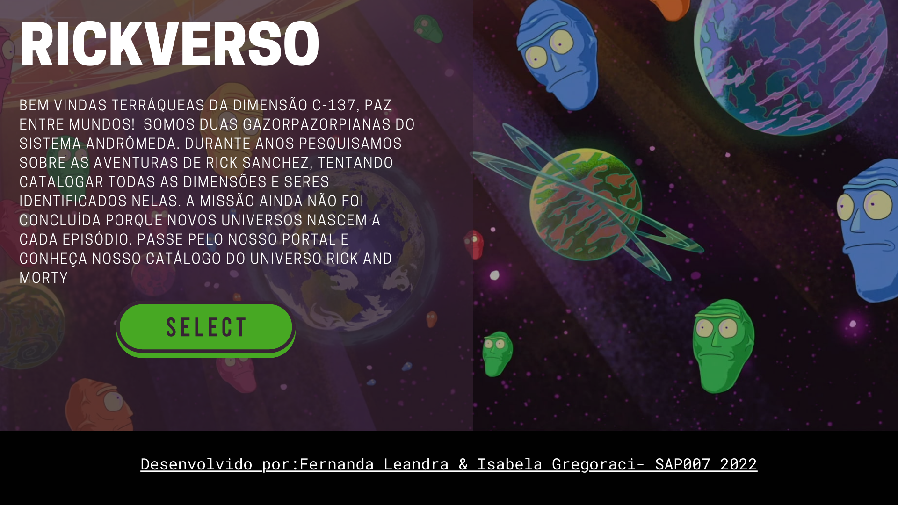
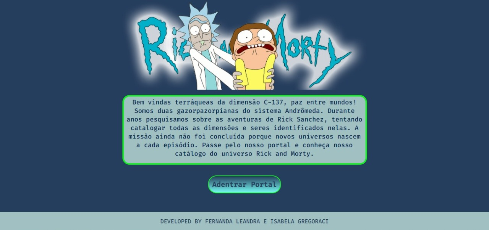
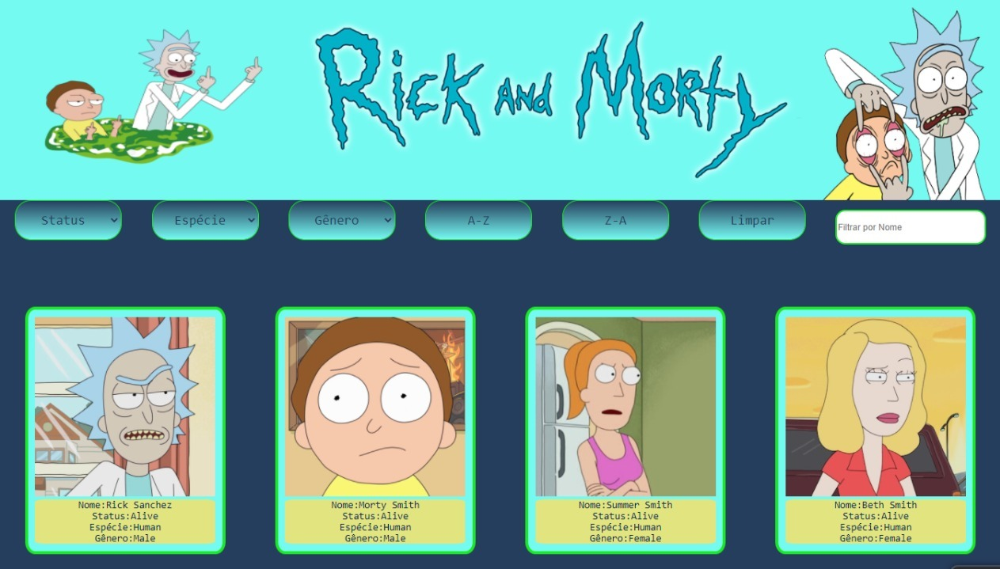
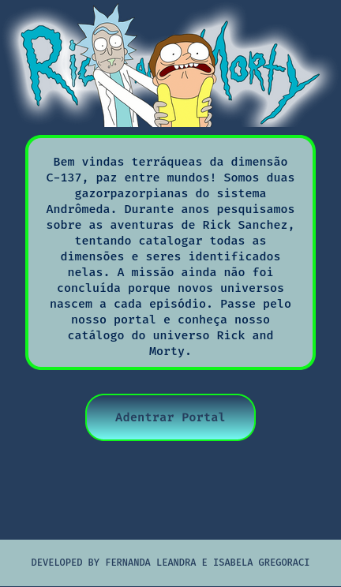
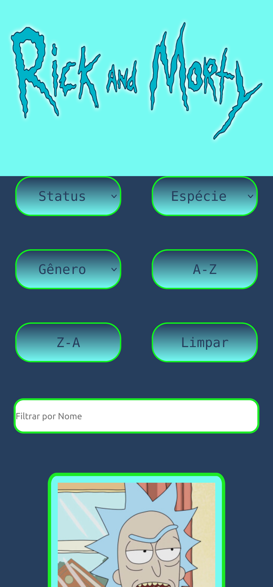

# Cida(delas) apresenta: RICKVERSO

## Índice

- [1. Introdução ao Rickverso](#1-introdução-ao-rickverso)
- [2. Perfil & História do Usuário](#2-perfil-&-história-do-usuário)
- [3. Protótipos de Layout](#3-protótipos-de-layout)
- [4. Aprendizado](#4-aprendizado)
- [5. Ferramentas Ultilizadas](#5-ferramentas-ultilizadas)
- [6. Linguagens Ultilizadas](#6-linguagens-ultilizadas)

## 1. Introdução ao Rickverso

Paz entre mundos terráqueas(os) da dimensão C-137, este é o Rickverso de Rick and Morty!

Para quem ainda não conhece, a série é um prato cheio para amantes de ficção científica. Rick Sanchez, um cientista um tanto quanto genial e de moral duvidosa, leva seu neto e, mais tarde também, sua neta Summer em aventuras à galáxias e dimensões paralelas. A série tem muitas referências de filmes como Mad Max, Star Wars, Senhor dos Anéis entre outros.

Para quem assiste a série, sabe que é impossível acompanhar todas as dimensões e personagens que existem, já que se multiplicam a cada episódio. Pensando nisso, a aplicação Rickverso vem como uma solução em forma de catálogo com cards para fãs da série que querem conhecer e buscar informações sobre os personagens.

Escolhemos o nome Rickverso em referência aos multiversos e dimensões que existem na série. O pretexto para criar um catálogo de personagens foi de que somos alienígenas do planeta Gazorpazorp e que investigamos as aventuras de Rick Sanchez com o intuito de mensurar todas as dimensões e seres do Universo.

As informações usadas são da fonte: https://rickandmortyapi.com/

### Planejamento

Para a realização do projeto, tomamos como referêcia o período de quatro semanas e ultilizamos da metodologia ágil para nos planejar. A ferramenta ultilizada para esse intuito foi o Trello.

## 2. Perfil & História de Usuário

A partir dessa pesquisa já feita com fãs de Rick and Morty, escolhemos os filtros que achamos mais intuitivos e claros para o usuário poder categorizar os personagens, que são: status (vivo, morto ou indefinido), gênero (feminino, masculino ou indefinido) e espécie (humano, humanoide, animal ou alienígena).

Além disso, o usuário também poderá saber quantos personagens existem na série de uma mesma espécie que selecionar.

### Perfil de Usuário

Traçando o perfil de usuário, chegamos a algumas conclusões:

-Em sua maioria, são adultos e adolescentes

-Pessoas que gostam de ficção científica e/ou desenhos como The Simpsons, Futurama, Family Guy

### História de Usuário

História 1: "Como fã da série Rick and Morty, sei que muitos personagens interessantes aparecem em só um episódio e eu gostaria de saber o nome e espécie deles."

Definição de pronto 1: Cards que contém fotos e nome com boa vizualização, para que o usuário possa identificar pela imagem o personagem que quer saber mais informações, tal como local de origem.

História 2:"Eu, usuária, gostaria de poder pesquisar um personagem pelo nome para saber mais informações sobre ele."

Definição de pronto 2: Input ao lado dos filtros, dando a escolha da usuária buscar um personagem por nome.

História 3: "Como usuário, quero saber quantidade de personagens que se encaixam em cada categoria."

Definição de pronto 3: Ao aplicar o filtro de cada categoria escolhida, o usuário pode ver na página html uma mensagem printada dizendo a porcentagem de personagens que se encaixam na categoria.

## 3. Protótipos de Layout

Para este projeto, tínhamos que fazer primeiro um protótipo de baixa fidelidade, mais simples e sem necessidade de usar ferramentas, apenas para esboçar uma primeira solução de interface que suprisse as necessidades do usuário.

Ultilizamos o Canva para fazer o protótipo de alta fidelidade, que deve demonstrar o máximo potencial de interface que gostaríamos de criar, por mais que não consigamos seguir a risca(ou não tenhamos tempo). Primeiramente, buscamos por imagens de fundo com temas do Rick and Morty e paletas de cores que se mostram presentes durante a série. Tivemos algumas opções de layouts pensadas, essas apenas da página de apresentação, pois queríamos montar a página principal a partir da paleta de cores escolhida na anterior.

O escolhido foi o que deixou a marca visual mais Rick and Morty possível. Além disso, buscamos um layout simples e intuitivo para o usuário, tanto na página de introdução, quanto na principal. Dessa forma, a vizualização dos cards com personagens fica clara, e também as formas de filtragem.

### Layout escolhido:

Adaptamos a disposição dos elementos da nossa aplicação ao tamanho de diferentes telas a partir do princípio do design responsivo, e esses foram os resultados em dispositivo mobile:

## 4. Aprendizado

O projeto Data Lovers é o segundo feito no bootcamp, e tivemos um verdadeiro salto exponencial em relação ao primeiro, já que novos conceitos foram apresentados e ultilizados, como o uso de media query para trazer responsividade e a criação de testes unitários pelo Jest para garantir a funcionalidade do código. Porém, o verdadeiro coração desse projeto é a manipulação de objetos e arrays, de como trazer para a tela do usuário informações de um banco de dados.
Além disso, aprendemos como trabalhar com branchs (pull request, merge, atualizar main), commitar de forma padrão, a importância de traçar um perfil e história de usuário,e também suas definições de pronto.

## 5. Ferramentas Ultilizadas

Código:
-Git & Github: controle de versão, criação de branchs, commits e deploy final no Github Pages.
-Vscode: editor de código.

Comunicação:
-Zoom.
-Whatsapp.
-AnyDesk.
-Slack.

Protótipo:
-Canva.

## 6. Linguagens Ultilizadas

-JavaScript(puro).
-HTML5.
-CSS3.
-Jest (testes unitários do JavaScript).

### Projeto desenvolvido por Fernanda Leandra e Isabela Gregoraci- SAP007 Laboratória 2022

<table>
  <tr>
    <td alig="center">
      <a href="#">
         
        
          <h2><a style="color:purple" href="https://github.com/Fernanda741" target="_blank">Fernanda Leandra</a></h2> 
        
      </a>
    </td>
    <td alig="center">
      <a href="#">
         
        
          <h2><a style="color:purple" href="https://github.com/Gregisa" target="_blank">Isabela Gregoraci</a></h2> 
        
      </a>
    </td>
  </tr>
</table>
